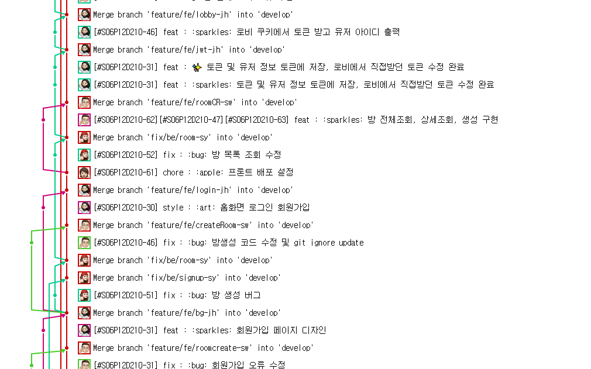
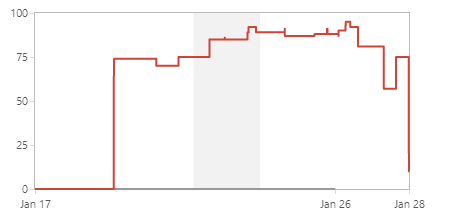
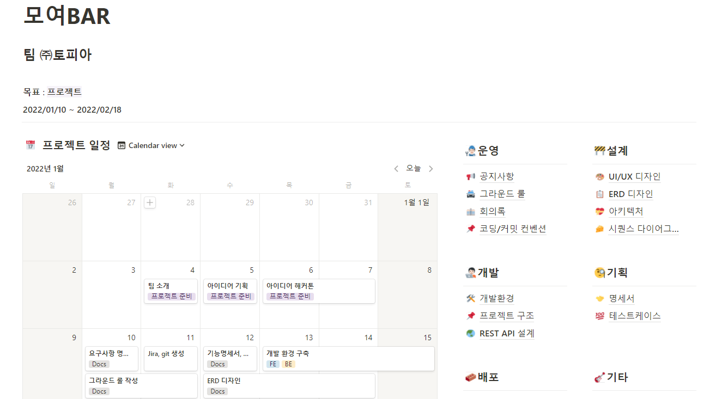

# 🍻 MOYOBAR

#### 온라인 모임/술자리 지원 플랫폼

기간 : **2022/01/10 ~ 2022/02/18**


## 👩‍👩‍👦‍👦 팀원

**이종현**(팀장)

- Jira 관리

**이상현**(부팀장)

- CI/CD 및 배포

**박승원**

- Front-end 리더

**지수연**

- Back-end 리더

**최영빈**

- Notion 관리

**허유진**

- 발표 및 디자인 책임자


## ⚙︎기능 소개

#### 비대면 술자리 / 모임 서비스


### **유저 서비스**

- 회원가입 및 로그인
- KAKAO & GOOGLE 로그인 제공

### **MOYOBAR 로비**

- 실시간 로그인 유저 리스트 제공
- 모임 정렬(시간순, 인원순) 기능
- 개별 모임 정보 제공
- 검색 기능

### **술자리 서비스**

- 화상 화면/오디오 제어
- 테마 설정 기능
- 인원 제한
- 건배 제의 기능
- 강제 퇴장
- 술게임 기능 제공
- 유저 주량 정보

### **프로필**

- 유저 정보 수정 기능(마이페이지)
- 유저 정보 조회
- 모임 참가 로그 확인
- 술게임 랭킹 제공

### **기타**

- 서비스 및 술게임 튜토리얼 제공

## 🖥 기술 스택

```
__프론트엔드__
- Visual Studio Code
- React.js 17.0.2
- styled-components 5.3.0
- Material-UI
- redux-toolkit 1.6.1
- redux 4.1.0

__백엔드__
- IntelliJ
- spring boot 2.4.5
- spring-boot-jpa
- Java 8
- mysql 8.0.26
- redis

__Web RTC__
- openvidu 2.19.0

__AWS EC2__
- docker
- nginx
- jenkins
```


## 🌆 협업

## Git



**Git 사용 규칙**은 다음과 같습니다.

1. 모든 개발 전, Jira에 이슈 먼저 생성하기.
2. merge 하기 전 최소 1명 이상에게 코드리뷰 받기.
3. 아래의 커밋 형식을 따르기.


### 브랜치 규칙

Git-Flow에 따른 브랜치를 분기합니다.

- master
- develop
- feature
- release
- hotfix

```
{branch_type}/{fe_or_be}/{branch_name-user_name}
```

ex) `feature/fe/login-sh`


### 커밋 메세지 구조

```
################
# <타입> : <제목> 의 형식으로 제목을 아래 공백줄에 작성
# 제목은 50자 이내 / 변경사항이 "무엇"인지 명확히 작성 / 끝에 마침표 금지
# 예) [#Jira이슈번호]feat : :sparkles: 로그인 기능 추가

# 바로 아래 공백은 지우지 마세요 (제목과 본문의 분리를 위함)

################
# 본문(구체적인 내용)을 아랫줄에 작성
# 여러 줄의 메시지를 작성할 땐 "-"로 구분 (한 줄은 72자 이내)

################
# 꼬릿말(footer)을 아랫줄에 작성 (현재 커밋과 관련된 이슈 번호 추가 등)
# 예) Close #7

################
# [#Jira이슈번호] feat : :sparkles: 새로운 기능 추가
# [#Jira이슈번호] fix : :bug: 버그 수정
# [#Jira이슈번호] docs : :memo: 문서 수정
# [#Jira이슈번호] test : :white_check_mark: 테스트 코드 추가
# [#Jira이슈번호] refact : :zap: 코드 리팩토링
# [#Jira이슈번호] style : :art: 코드 의미에 영향을 주지 않는 변경사항
# [#Jira이슈번호] chore : :apple: 빌드 부분 혹은 패키지 매니저 수정사항
# [#Jira이슈번호] error : :rotating_light: 에러가 해결되지 않은 코드. merge request 하면 안 됨
################
```

**사용 예시**

```
[#Jira이슈번호] feat : :sparkles: 로그인 기능 추가

- 로그인 ui 개발
- 로그인 기능 개발

 Close #7
```


## Jira



Jira를 사용해 스프린트 별 업무, 일정 등을 관리하였습니다. 스프린트가 시작되는 날 필요한 이슈들 등록하고 가능한 기간 내에 완수할 수 있도록 하였습니다.

`Epic`은 로그인, 회원가입, 회원관리, 모임관리, 서버 배포설정으로 나누었고,

`Task`는 (BE)로그인, (FE) 로그인 등으로 나누었습니다.

`SubTask`는 (BE)로그인 기능 API, (FE) 회원가입 폼 작성 등으로 작업을 세세하게 나누었습니다.

# Notion

------

프로젝트와 관련한 일정, 그라운드룰, 팀 아이디어 설계부터 기획, 개발 컨벤션, 문서 작업 등을 노션에서 진행하였습니다.



## 💭 후기
