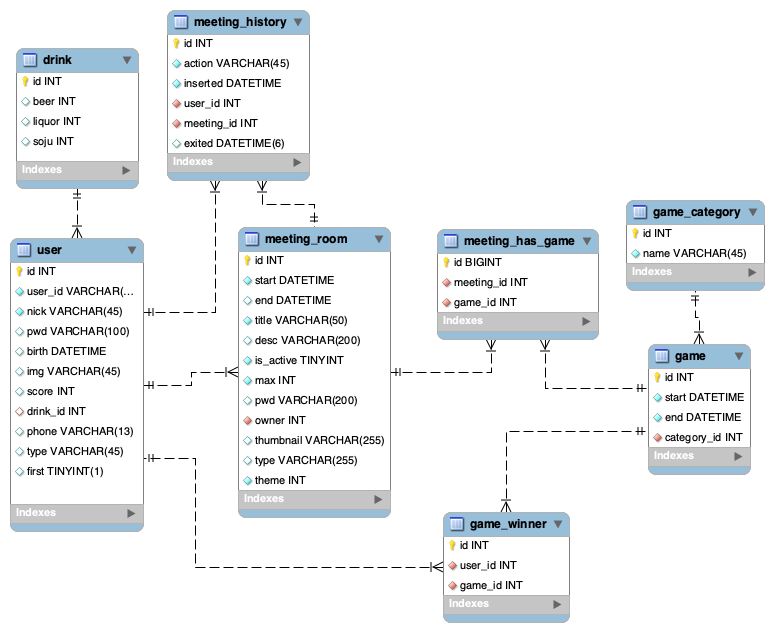

# 🍻 MOYOBAR

## 🐱‍🏍기획의도

**모여BAR**는 온라인으로 마주보면서 소통하며 술을 즐길 수 있는 **언택트 술자리 모임 서비스**입니다.

직접 사람들을 만나 함께 술을 마시기 어려운 요즘, “**랜선술자리**”는 빠르게 주목받고 있습니다. 이렇게 랜선 술자리에 대한 사람들의 니즈가 존재하는데, 디스코드, Webex와 같은 서비스들은 랜선 술자리로 사용하기에는 부족한 면이 있습니다.

그래서 온라인으로 소통하면서 음주를 즐길 수 있는 술자리 모임/술게임 서비스인 **모여BAR**를 기획하게 되었습니다.

## 🍻서비스 주요내용

1. 실시간 화상 모임 및 채팅💬

2. 다양한 술게임 및 건배 기능 제공
3. 공개방, 비밀방 설정 및 방 테마 설정
4. 정렬, 검색, 필터 기능으로 방 목록 조회
5. 게임 결과 기반 스코어 측정 및 우승자 선정✨
6. 튜토리얼 서비스 제공(전체 서비스, 게임)
7. 현재 접속 중인 유저 조회 기능
8. 회원정보수정 통해 프로필 사진 및 자기소개 추가
9. 회원별 방 참여로그 및 그래프 제공
10. 게임 스코어 기반으로 top 10 랭킹 기능 제공

## MOYOBAR **시연 및 시나리오**

MOYOBAR 시나리오는 [[시연 시나리오](./exec/시연시나리오.md)] 에서 더 자세히 보실 수 있습니다.

## MOYOBAR **서비스 화면**

### 🥂메인화면

- 모여바(MOYOBAR) 서비스의 메인 화면입니다. ‘**입장하기**’ 버튼을 클릭하면 로그인 페이지로 넘어갑니다.


### 🥂로그인

- 모여바 서비스만의 자체 로그인 및 회원가입 기능을 제공합니다.
- 간편하고 빠르게 서비스를 이용할 수 있도록 소셜 로그인(구글, 카카오) 기능도 함께 제공하고 있습니다.


### 🥂회원가입

- 이메일, 닉네임, 휴대전화 번호, 생일 등 기본 회원 정보를 입력합니다.
- 자신의 소주/맥주/양주 주량 정보도 입력합니다.
- 또한, 모여바 서비스는 술자리 모임/술게임 서비스이므로 성인 인증이 필요합니다. 생년월일을 입력한 후에 간단하게 본인의 출생년도에 해당하는 띠를 맞추면 성인 인증이 완료됩니다.


### 🥂로비 **- 방 생성**

- 로그인에 성공하면 로비 페이지로 이동합니다.
- 현재 접속 중인 유저 리스트와 방 목록을 볼 수 있습니다.


- 왼쪽 상단의 ‘**방 생성**’ 버튼을 클릭하여 방 생성을 완료할 수 있습니다.
- 방 이름, 최대 인원수 설정, 방 소개글, 방 공개/비공개 여부, 테마사진을 선택한 후 ‘**생성하기**’ 버튼을 클릭합니다.


### 🥂회원정보 - 유저프로필

- 로비 페이지의 유저 리스트에서 자신의 프로필뿐만 아니라 다른 사람의 프로필도 조회할 수 있습니다.


### 🥂회원정보 - 참가내역

- 회원정보 프로필 화면에서 해당 유저의 방 참가 내역을 그래프로 확인할 수 있습니다.


### 🥂회원정보 - 랭킹

- 회원 정보 프로필에서 해당 유저의 술게임 랭킹 정보 및 게임 스코어를 확인할 수 있습니다.


### 🥂방 - 마이크 카메라 ON / OFF

- 방 입장 시, 하단의 카메라와 마이크 버튼을 클릭하여 카메라-마이크 ON/OFF를 설정할 수 있습니다.


### 🥂방 - 건배

- 방 입장 후, 오른쪽 상단의 맥주 아이콘 버튼을 클릭하여 같은 방 사람들에게 건배 제안을 할 수 있습니다.


### 😈서비스 가이드

- 방 입장 후, 왼쪽 하단의 **? 아이콘**을 클릭하여 서비스 튜토리얼을 확인할 수 있습니다.


- 또한, 술 게임별로도 튜토리얼을 확인할 수 있습니다.

.png>)

### 😈술게임 **- 라이어게임**

- 라이어 게임은 혼자만 제시어를 받지 못한 라이어를 찾아내는 게임입니다.
- 주어진 180초 동안 회의를 거쳐, 라이어라고 생각하는 사람에게 투표합니다.


- 투표가 종료되면 투표 결과와 라이어의 승패여부가 도출됩니다.


### 👍술게**임**👎 **- 업다운게임**

- 업다운 게임은 숫자를 추측하여, 정답 숫자보다 크면 업👍, 작으면 다운👎을 받아 정답을 맞추는 게임입니다
- 주어진 10초 동안 답을 입력하지 않으면, 차례는 다음 사람으로 넘어갑니다


### 💬술**게임 - 초성게임**

- 초성 게임은 초성이 주어지고 해당 초성에 맞는 단어를 말하는 게임입니다
- ‘Web Speech API’ 를 통해 마이크에 단어를 말하면, 음성 인식을 합니다
- 입력된 단어는 ‘우리말 샘 API’ 를 통해 사전에 있는 단어인지 판별하여 정답 여부가 가려집니다
- 한번 입력한 단어를 다시 입력할 시에도 오답으로 인정됩니다.


## 개발환경

## 💎Frontend

- **IDE**: VSCode
- **Language**: HTML5, javascript, CSS3
- **Library**: React 17.0.2, SCSS, TypeScript, Axios, Redux, stompjs, sockjs
- **Open API**: Web Speech API
- **Framework**: Material-UI
- **node.js 16.13.x**

## 👑Backend

- **IDE**: intellij 2021.3.1
- **Lanuage**: Java 1.8
  - openjdk version "1.8.0_192"
  - OpenJDK Runtime Environment (Zulu 8.33.0.1-win64) (build 1.8.0_192-b01)
  - OpenJDK 64-Bit Server VM (Zulu 8.33.0.1-win64) (build 25.192-b01, mixed mode)
  - 8.0.322-zulu
- **Library**: JWT, spring-boot-jpa, Spring Security, Stomp
- **Open API**: SNS 로그인(kakao, google), 우리말 샘
- **Framework**: SpringBoot 2.4.5

📎**백엔드 파일 관리**

- Mysql 접속정보는 application.yml 파일에서 mysql.yml파일을 읽는 것으로 관리
- mysql.yml파일은 gitignore에 추가

## 🧑‍💻WebRTC

- **OpenVidu**

## 💡DB

**MySQL** 8.0.28

**AWS S3** (Image Server)

## 🌳OS, Server

**AWS EC2**

- **Ubuntu** 20.04 LTS
- Jenkins 2.334
- Nginx 1.18.0
- Docker 20.10.12
- Docker-compose 1.28.5

## 💡기획 및 협업툴

- **회의록** : Notion
- **코드관리**: GitLab
- **일정관리**: JIRA
- **와이어프레임, 시퀀스 다이어그램**: Figma, Google PPT
- **명세서 작성**: SpreadSheets
- **회의** : Webex, Mattermost, Discord

## 서비스 아키텍쳐


## ER Diagram



## 👩‍👩‍👦‍👦 팀소개


## 🌆 협업

## 📣 Git 사용 기본 규칙

1. 모든 개발 전, Jira에 이슈 먼저 생성할 것.
2. merge 하기 전 최소 1명 이상에게 코드리뷰 받을 것.

### 브랜치 이름 규칙

Git-Flow에 따른 브랜치를 분기합니다.

- **master**
- **develop**
- **feature**

`{branch_type}/{fe_or_be}/{branch_name-user_name}`

ex) `feature/fe/login-sh`

### 커밋 메세지 구조

- IDE에서 작성 시

```
[#Jira이슈번호] feat : :sparkles: 로그인 기능 추가

- 로그인 ui 개발
- 로그인 기능 개발

 Close #7
```

## 💙후기

### 이종현

처음 공통 프로젝트를 시작할 때 6주라는 긴 기간과 6명이라는 많은 인원이 함께 협업하는게 처음이라 막막했었습니다.
특히 React를 처음 사용하면서 프로젝트 시작 2주간은 개별 공부만 했었는데 프로젝트가 끝난 지금 생각해보면 꼭 필요한 시간이었던 것 같습니다.
처음 만난 팀원들이라 어색했었는데 많이 친해져서 프로젝트 진행하는데 수월했습니다. 프로젝트를 통해 저 스스로도 많이 성장했고 의미 있는 시간이었습니다.
다음에 기회가 된다면 다시 한번 D210팀과 함께 프로젝트를 해보고 싶습니다. 모두들 안녕..

### 지수연

왜 현업에서 협업을 중요시하는지 깨닫게 되는 경험이었습니다. 팀원들과 소통하며 해결해가는 과정이 즐거웠습니다.
처음엔 서먹해서 회의 때 마이크 켜기가 두려웠는데 지금은 저를 상대로 놀려도 그러려니 하게 되는 게 재밌었습니다.
또한 개인적으로 진행할 때에는 구현에 목적을 두면 체계가 잘 안 서고, 체계를 세우려다 보면 구현이 늦어지는 사이에서 균형을 맞추는 연습을 팀프로젝트를 진행하며 팀원들과 함께 할 수 있어 많은 도움이 되었습니다.
백엔드 개발을 하면서 OAuth, JWT, WebRTC, Socket 등에 대해 공부할 수 있게 되어 유익한 경험이었습니다.
각종 오류들을 직접 해결하면서 백엔드 개발에 대한 개념을 좀 더 익힐 수 있었던 계기가 되었습니다.
이전 경험이 현재의 프로젝트에 많은 도움이 되었던 것처럼 MOYOBAR 프로젝트 경험이 앞으로의 개발에 있어 큰 도움이 될 것 같습니다.
그리고 배포는 너무 어렵습니다!

### 최영빈

평생 처음 해보는 프로젝트였는데, 팀원 모두 무슨 일이든 본인이 하시겠다고 하시는 적극적인 모습에 큰 자극이 되었습니다.
짧은 기간이었지만 많은 것을 공부할 수 있었습니다.
프론트엔드를 맡았지만 리액트, CSS 모두 아직 미숙해 구상한 대로 자유롭게 구현할 수 없어서 아쉬웠고 프로젝트를 거치며 성장해 나가야 할 것 같습니다.
백엔드 쪽은 아예 배경지식이 없어 프론트, 백 전반을 아우르는 학습도 병행해야 할 듯합니다.
무엇보다 결과물이 예상했던 대로 모두 구현이 되어 앞으로의 프로젝트에도 큰 자신감이 될 것 같습니다.

### 이상현

서버 배포를 해보면서 왜 도커와 젠킨스가 왜 많이 쓰이는지 그리고 실제 배포 시에 어떤 문제가 있는지에 대해 직접 경험해 볼 수 있었습니다. Git, Jira 사용으로 팀원들과 협업을 해보며 개발프로세스가 어떻게 돌아가는지 파악해볼 수 있었습니다.

### 허유진

이번 프로젝트를 통해 깃 플로우, 지라 등의 현업 협업툴을 배우고 활용해볼 수 있어서 좋았고 좋은 팀원들과 프로젝트의 마무리 기간까지 끝까지 함께 할 수 있어서 큰 영광이었습니다.
프로젝트를 진행하면서 기획 단계에서 개발 단계까지 고려하여 최대한 구체적으로 기획하는 것의 중요성을 깨닫게 되었고 사용자 입장에서 생각하면서 로직이나 UI/UX를 구성해야한다는 것을 배울 수 있었습니다.
또한, 이번에 백엔드 포지션을 맡으면서 Spring boot와 JWT, Spring security 등을 활용했는데 아직 부족한 점이 많아 여러 우여곡절을 겪었고 생각만큼 빠르게 기술을 습득하고 적용하질 못해서 개인적으로 아쉬움이 있었던 것 같습니다.
앞으로는 프로젝트 시작 전에 미리 프로젝트에서 사용될 기술 스택이나 관련 지식을 습득해두어 보다 빠르고 정확하게 개발에 참여할 수 있도록 하고, 백엔드 포지션으로서 Spring boot에 대해 더 심도있게 공부해야겠다고 생각했습니다.
또한, CI/CD에 대해서도 공부하여 다음부터는 인프라 구축에도 적극적으로 참여할 수 있도록 해야겠다고 생각했습니다.
마지막으로, 프로젝트 기획-설계-개발-테스팅-배포까지 이 많은 일들을 함께 해냈다는 것이 정말 믿기지 않고 프로젝트를 무사히 끝마치게 되어 뿌듯합니다!!
6주라는 짧은 기간동안에 뛰어나신 팀원들 덕분에 정말정말 많이 배우고 성장할 수 있는 좋은 경험이었던 것 같습니다.
모두 너무 수고많으셨고 모여바 파이팅~!! :smile:

### 박승원

한층 더 업그레이드

프론트엔드 기술스택이 쌓였습니다. React와 Typescript를 스스로 공부하고 바로 프로젝트에 적용하는 과정을 통해 개발자로서 한층 더 성장하였습니다.
또한 openVidu 라이브러리를 활용하여 Web RTC 분야에 프로젝트를 수행하면서, 새로운 분야의 프로젝트를 하는 것에 흥미를 느꼈습니다.
개발자로서 앞으로 만날 다양한 프로젝트에서 새로운 분야에 해보지 못한 생소한 분야에도 도전할 수 있는 자신감을 길렀습니다.

협업

Git Flow 방식의 협업 과정을 통해 프로젝트를 관리하면서, 협업 능력이 한층 더 성장하였습니다.
뿐만 아니라 Jira를 활용한 스프린트를 관리하고, 같은 팀 뿐만 아닌 전체 프로젝트의 진행상황을 볼 수 있는 시야를 길렀습니다.
앞으로 수행하게 될 다양한 프로젝트와 같은 팀원들과의 의사소통이 한층 더 원활하게 진행될 수 있다고 자신하게 되었습니다.
