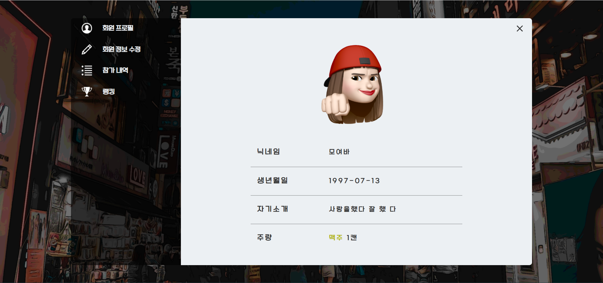

# 시연 시나리오

## 메인

사이트로 입장하기 버튼이 중앙에 위치하여 로그인 페이지로 이동합니다.

## **로그인**

로그인 페이지는 이메일과 비밀번호를 입력할 수 있는 폼이 오른쪽 중앙에 위치합니다.

정보 입력 후 로그인 버튼을 클릭 시 유효성 검사 후 로비 페이지로 이동합니다.

또한 카카오와 구글을 이용한 소셜 로그인을 이용하여 로그인 한 후 마찬가지로 로비 페이지로 이동합니다.

아직 회원이 아닌 경우에는 ‘회원아 아니신가요? 지금 가입하세요’ 링크를 통해 회원가입 페이지로 이동합니다.

## 회원가입

회원가입은 이메일, 비밀번호, 비밀번호 확인, 닉네임, 휴대전화 번호, 생년월일, 주량, 총 7개의 폼으로 이루어집니다.

이메일과 닉네임은 폼 오른쪽의 버튼을 통해 중복확인 검사를 제공하고, 술자리 플랫폼에 맞게 나이를 체크할 수 있는 성인인증 확인 버튼을 클릭하여 생년월일에 알맞는 띠를 입력했을 때만 회원가입이 가능합니다.

회원가입 버튼을 클릭하면 회원가입이 완료되고 로그인 페이지로 이동합니다.

‘로그인으로 돌아가기’링크를 클릭 시에는 회원가입이 완료되지 않고 로그인으로 이동합니다.

## 로비

화면의 왼쪽에는 현재 로그인 중인 사용자의 목록을 나타냅니다. 사용자의 프로필 사진, 닉네임, 주량을 표시합니다. 사용자 컴포넌트 위에 마우스를 올리면 버튼이 나타나고, 이 버튼을 누르면 사용자의 프로필 페이지로 이동합니다.

화면 우측 상단에는 로그인한 유저의 프로필을 확인할 수 있는 마이페이지 버튼과 로그아웃 버튼이 있습니다. 마이페이지 버튼을 클릭할 시, 자신의 프로필 페이지로 이동합니다. 로그아웃 버튼을 클릭할 경우, 로그아웃이 실행되고 로그인 페이지로 이동합니다.

화면의 중앙 부분은 현재 진행중인 미팅룸의 상태를 나타냅니다. 방 종류에 따라 공개/비공개 방으로 나뉩니다.

최대 수용 인원과 현재 참여 인원, 더 이상 입장이 불가한지 여부를 초록색과 빨간색 신호로 한 눈에 알아볼 수 있습니다.

공개방을 클릭 시 방에 대한 정보가 모달창으로 뜨고 입장하기 버튼을 클릭 시 해당 미팅 룸으로 이동합니다.

비밀방을 클릭 시, 마찬가지로 방에 대한 정보와 비밀번호 입력창이 제공되어 입력 후 이동합니다.

목록 우측 상단의 카테고리와 입력 폼을 통해 원하는 방의 키워드를 검색해 방 목록이 업데이트 되는 것을 확인 합니다.

좌측 상단의 방 생성하기 버튼을 통해 방 이름, 인원 수, 방 소개, 공개여부, 테마 선정을 입력 한 후 생성하기 버튼을 클릭하면 해당 미팅 룸으로 이동합니다.

## 프로필

프로필페이지로 이동 시 좌측에는 사용자의 정보를 나타내는 회원 프로필, 회원 정보 수정, 참가 내역, 랭킹 4개의 메뉴로 구성됩니다. 우측에는 해당 메뉴에 따른 정보가 표시됩니다.

회원 프로필에는 회원의 사진, 닉네임, 생년월일, 자기소개, 주량의 정보가 제공됩니다.

회원 정보 수정 버튼은 자신의 프로필인 경우에 버튼을 확인하고 이동할 수 있습니다. 회원 정보 수정 페이지에서는 회원의 닉네임, 자기소개, 프로필 사진, 주종과 주량을 수정할 수 있는 입력 폼이 주어집니다. 이를 통해 수정 버튼을 클릭 시 변경된 정보를 확인할 수 있는 회원 프로필 페이지로 이동합니다.

참가 내역 버튼을 클릭 시 오른쪽 화면에 회원의 접속 이력이 표시됩니다. 모인 시간과 모인 횟수를 차트로 확인할 수 있습니다.

랭킹 버튼 클릭 시 현재 MOYOBAR 회원 랭킹 TOP 10과, 회원의 랭킹이 표시되며, 게임으로 얻은 포인트 점수를 차트로 확인할 수 있습니다.

## 미팅 룸

방 입장 시 우측 상단에는 방 제목을 표시합니다.

우측 상단에는 건배를 유도할 수 있는 모달 창을 띄우는 건배 버튼과 게임 시작을 위한 조이스틱 버튼이 있습니다.

건배버튼을 누르면 사람들의 호응을 부를 모달 창을 띄울 수 있습니다.

우측 하단에는 방을 나갈 수 있는 나가기 버튼이 있습니다. 이를 통해 로비로 이동합니다.

화면 중앙에는 접속한 사용자들의 카메라가 뜨며 화상 회의가 가능합니다. 화면의 아래쪽에 있는 마이크 버튼과 카메라 버튼을 통해 on/off 기능을 제공합니다.

왼쪽 하단의 하얀색 물음표 버튼은 방에 대한 튜토리얼을 제공합니다.

오른쪽 아래 파란색 물음표 버튼은 게임 튜토리얼을 제공해 게임 방법을 확인할 수 있습니다.

오른쪽 하단의 채팅 창버튼을 클릭하면 사용자간 메시지를 주고 받을 수 있는 채팅 창이 뜨게됩니다.

## 술게임

술 게임은 미팅 룸 오른쪽 화면에 구성되어 있습니다.

조이스틱 버튼을 클릭 시 업다운 게임, 초성 게임, 라이어 게임을 실행할 버튼이 표시됩니다. 방장이 이 버튼을 클릭하면 시작 버튼이 화면에 노출됩니다. 방장이 이 시작 버튼을 클릭하면 게임이 시작됩니다.

업다운 게임은 첫 시작하는 사람에 의해 타이머가 시작됩니다. 주어진 차례에 1~100까지의 숫자 중 하나를 입력하도록 사용자에게 입력 폼을 제공합니다. 자신의 입력이 끝난 경우, 입력 폼은 사라지고 입력 값이 대한 정보가 출력됩니다. 정답을 맞출 때까지 반복 후 맞춘 사람의 이름이 해당 위치에 노출됩니다.

초성 게임은 화면에 두 자음 두 개가 표시됩니다. 자신의 차례에는 입력 모달이 자동으로 표시되고 해당하는 단어를 음성인식을 통해 인식 시키고 닫기 버튼을 통해 다음 순서로 이동합니다. 입력이 끝난 후 입력된 값을 화면에 노출이 되고 다음 사람이 인식하도록 합니다.

라이어 게임은 랜덤으로 라이어가 지정 되어 실행합니다. 일반 사용자에게는 주제에 대한 제시어가 제공됩니다. 라이어는 주제만 제공되어 게임을 진행합니다. 투표하기 버튼을 통해 모달 창이 뜨면 라이어로 의심되는 사람을 투표할 수 있고,

시간이 다 지나거나 투표가 모두 완료된 경우 결과값을 화면에 표시합니다.
